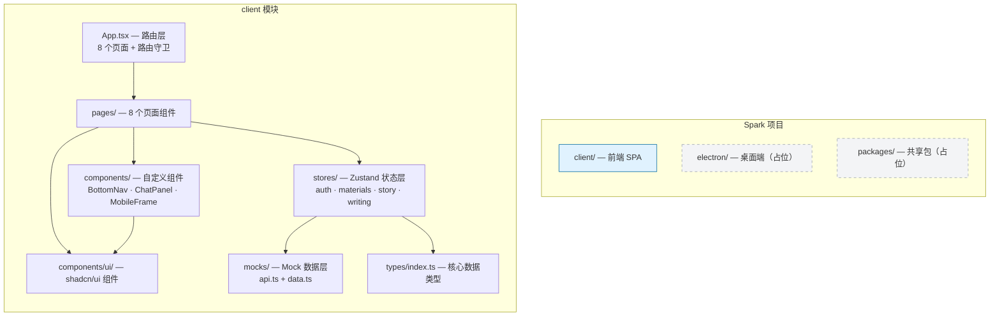

# CLAUDE.md

This file provides guidance to Claude Code (claude.ai/code) when working with code in this repository.

## 项目概述

**Spark** — AI 辅助短篇小说写作移动端 Web 应用。核心流程：输入创意 → AI 生成设定 → 确认/修改 → AI 生成大纲 → 逐章生成正文 → 审核编辑 → 完成故事。

## 快速命令

```bash
# 开发（在 client/ 目录下执行）
cd client
npm install
npm run dev          # Vite 开发服务 http://localhost:5173
npm run build        # TypeScript 编译检查 + 生产构建
npm run lint         # ESLint 检查
```

## 架构总览



## 模块索引

| 模块 | 路径 | 状态 | 说明 |
|------|------|------|------|
| **client** | `client/` | 活跃 | 前端 React SPA，全部 UI 与交互逻辑 |
| **electron** | `electron/` | 占位 | 预留桌面端 |
| **packages** | `packages/` | 占位 | 预留共享包 |

> 详细模块文档见各目录下 `CLAUDE.md`。

## 技术栈

| 层面 | 选型 |
|------|------|
| 框架 | React 19 + TypeScript ~6.0 + Vite 8 |
| UI | Tailwind CSS v4 + shadcn/ui (New York 风格) |
| 状态管理 | Zustand v5 (4 个 Store) |
| 路由 | React Router v7 |
| HTTP 客户端 | Axios (已安装，尚未接入真实 API) |
| 图标 | Lucide React |
| 字体 | Inter (UI) + Noto Serif SC (正文) |
| 计划后端 | Fastify 5 + Prisma 6 (SQLite) + JWT 认证 (见 DEVC.md) |

## 全局规范

- **路径别名**：`@/` → `client/src/`（Vite + tsconfig 已配置）
- **样式**：Tailwind v4，通过 `@theme` 定义令牌，黑白主色 + 红色破坏性操作色
- **组件库**：shadcn/ui 组件放 `components/ui/`，自定义业务组件放 `components/`
- **状态**：Zustand Store 按领域划分（auth / materials / story / writing），每个 Store 独立文件
- **Mock 层**：所有 API 走 `mocks/api.ts`，模拟 600ms 延迟；对接真实后端时仅需替换此层
- **TypeScript**：严格模式，`noUnusedLocals` + `noUnusedParameters` 已启用
- **响应式**：移动优先，桌面端用 `MobileFrame` 组件包裹手机视口

## 关键文件速查

| 文件 | 用途 |
|------|------|
| `DEVC.md` | 全栈开发需求文档（含后端规划、API 设计、数据库模型） |
| `sdk.md` | pi Agent SDK 集成参考文档 |
| `client/src/types/index.ts` | Story、Material、User 等核心类型定义 |
| `client/src/mocks/api.ts` | Mock API 实现（替换此处接入真实后端） |
| `client/src/mocks/data.ts` | 测试用 Mock 数据集 |
| `client/src/index.css` | Tailwind 主题变量与全局样式 |

## 当前缺口

- **测试**：未配置测试框架（无 vitest/jest），零测试文件
- **后端**：全部为 Mock，无真实 API 服务
- **CI/CD**：未配置
